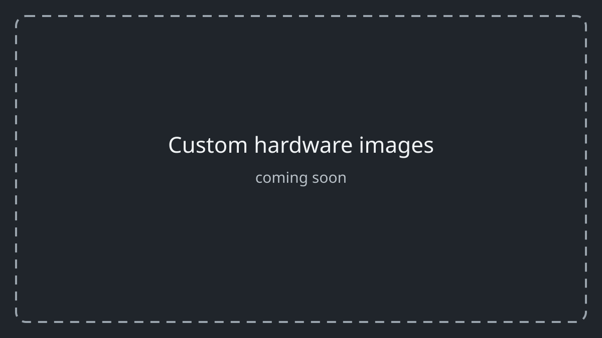

  

   
   

  

    
    
    
    
    
    
  

  

    
    
    
    
  

&nbsp;

## 📖 Explore the ESP32-DIV Wiki

Complete project story, in-depth tutorials, and all the features in [Wiki](https://github.com/cifertech/ESP32-DIV/wiki)! From Wi-Fi deauthentication attacks to Sub-GHz signal replay, the Wiki covers everything you need to get started. [Click here to explore now!](https://github.com/cifertech/ESP32-DIV/wiki)

> ⚡ **Skip the IDE** — flash directly from your browser at [cifertech.github.io/ESP32-DIV](https://cifertech.github.io/ESP32-DIV)

&nbsp;

## About this fork

This is an independent hardware adaptation of
[CiferTech's ESP32-DIV project](https://github.com/cifertech/ESP32-DIV).

The upstream firmware, documentation, libraries, graphics, and hardware
materials remain credited to their original authors and are used under their
respective licenses. This fork documents a different hardware configuration;
custom notes are under [docs/custom-hardware](docs/custom-hardware/).

This fork is not affiliated with or maintained by CiferTech.

> Project photographs and custom diagrams will be added as the hardware work
> progresses. The placeholder image is intentional.

<!-- About the Project -->
## :star2: About the Project
ESP32-DIV is an open-source, multi-band wireless toolkit built on the **ESP32-S3**. It covers Wi-Fi, BLE, 2.4GHz, Sub-GHz, IR, RFID/NFC, and GPS. all from a compact handheld device with a touchscreen UI. Whether you're analyzing wireless traffic, testing signal resilience, or building your own RF tools, ESP32-DIV gives you a single platform to do it all.

> [!WARNING]
> This project is intended for **educational and research purposes only**. Use only on networks and devices you own or have explicit permission to test. Unauthorized use may violate local laws.

<!-- Features -->
## :dart: Features

<strong>📡 Wi-Fi</strong>

  
| Tool | Description |
|------|-------------|
| Packet Monitor | Real-time waterfall graph across all 14 channels; optional PCAP logging to SD |
| Wi-Fi Scanner | Lists nearby networks with extended details |
| Beacon Spammer | Broadcasts fake SSIDs (custom or random) |
| Deauth Attack | Sends deauthentication frames to disrupt client connections |
| Deauth Detector | Monitors for incoming deauth attacks |
| Captive Portal | AP + DNS + web server; clone networks and force sign-in pages |
| Probe Flood | Floods probe requests to stress-test APs |
| Hidden SSID Revealer | Forces hidden networks to expose their SSID |
| WPS Scanner | Detects access points with WPS enabled |
| ARP Scanner | Maps all devices on a network with IP and MAC after joining |
| Karma Attack | Listens for probe requests and impersonates saved networks to auto-connect devices |

<strong>🔵 Bluetooth</strong>

  
| Tool | Description |
|------|-------------|
| BLE Scanner | Discovers hidden and visible BLE devices |
| BLE Sniffer | Tracks MAC, RSSI, packet count, and last-seen time |
| BLE Spoofer | Broadcasts fake BLE advertisements |
| Sour Apple | Spoof Apple BLE advertisements (e.g., AirDrop popups) |
| BLE Jammer | Disrupts BLE and classic Bluetooth channels |
| BLE Rubber Ducky | Acts as a BLE keyboard; executes scripts from `/ducky` on SD |
| AirTag Spoofer | Broadcasts fake AirTag signals into the Find My network |
| AirTag Sniffer | Monitors for AirTags in range |
| Skimmer Detect | Scans for BLE signatures matching known card skimmer profiles |

<strong>📶 2.4GHz / NRF24</strong>

  
| Tool | Description |
|------|-------------|
| 2.4GHz Scanner | Spectrum analyzer across 128 channels (Zigbee, custom RF, etc.) |
| Protokill | Disrupts Zigbee, Wi-Fi, and other 2.4GHz protocols |
| ESB Sniffer | Passively captures Enhanced ShockBurst NRF24 packets |
| ESB Replay | Replays captured ESB packets |
| MouseJack Scan | Detects vulnerable wireless mice and keyboards |
| MouseJack Inject | Injects keystrokes into vulnerable wireless receivers |

<strong>📻 Sub-GHz</strong>

  
| Tool | Description |
|------|-------------|
| Replay Attack | Captures and replays Sub-GHz commands (e.g., garage doors, remotes) |
| Sub-GHz Jammer | Disrupts Sub-GHz communication across various bands |
| Saved Profiles | Stores and manages captured signal profiles |
| De Bruijn / Brute Force | Cycles through all possible fixed codes for Sub-GHz remotes |
| Jamming Detector | Receive-only monitor that detects Sub-GHz jamming attacks (e.g. car-fob jamming) |

<strong>📺 Infrared (IR)</strong>

  
| Tool | Description |
|------|-------------|
| IR Replay Attack | Captures real IR presses, visualizes, replays, and saves to SD |
| IR Saved Profiles | Browses IR captures; preserves signal and carrier frequency |
| Universal IR Controller | Built-in profiles, SD imports, favorites, and remote-style control |

<strong>🧲 RFID / NFC</strong>

  
| Tool | Description |
|------|-------------|
| Card Reader | Reads UID and tag identification |
| Card Clone | Copies supported writable tags |
| Dump | Reads sectors/blocks when keys are available |
| Decode Access | Interprets access bits and ACL-style fields from dumps |
| Erase | Wipes supported writable tags |
| Jam Reader | Impedes another reader with RF patterns |
| Tag Disrupt | Advanced disruption flows for authorized physical tests |
| Disrupt Emulate | Disruption combined with emulation-style flows |

<strong>🛰️ GPS</strong>

  
| Tool | Description |
|------|-------------|
| Wardriver | Logs GNSS position with Wi-Fi/BLE observations to SD |
| Satellite Scanner | Shows satellites in view, signal strength, and fix diagnostics |

<strong>🧰 Device & System</strong>

  
| Tool | Description |
|------|-------------|
| Serial Monitor | Mirrors serial traffic on the TFT for field debugging |
| SD File Manager | Browses and manages files on the SD card |
| Update Firmware | Flashes new firmware from SD |
| Touch Calibrate | Four-corner XPT2046 touchscreen calibration |
| Settings | Brightness, dark/light theme, NeoPixel, background auto-scan |

&nbsp;

<!-- Project images -->
## Project images

&nbsp;

<!-- Hardware Overview --> 
## 🔧 Hardware Overview

ESP32DIV consists of two boards:

### 🧠 Main Board
- **ESP32-S3** – Main microcontroller with Wi-Fi and BLE
- **ILI9341 TFT Display** – 2.8" UI display
- **LF33** – 3.3V regulator
- **IP5306** – Lithium battery charging and protection
- **CP2102** – USB-to-serial for flashing
- **PCF8574** – I/O expander for buttons
- **SD Card Slot** – Stores logs and captured signals
- **Push Buttons** – Navigation and interaction
- **Antenna Connector** – External antenna support
- **WS2812 NeoPixels** - Giving better feedback
- **Buzzer** - It shares a GPIO with the battery voltage divider, so using it is optional.

### 🛡️ Shield
- **3x NRF24 Modules** – 2.4GHz jamming and spoofing
- **1x CC1101 Module** – Sub-GHz jamming and replay
- **Multiple antennas** - Extended range
- **IR Transceiver** - Capture & replay IR remotes

&nbsp;

<table>
  <tr>
    <td style="text-align: center;">
      
      
ESP32-DIV v2 Main Board

    </td>    
    <td style="text-align: center;">
      
      
ESP32-DIV v2 Shield

    </td>
  </tr>
</table>

<table>
  <tr>
    <td style="text-align: center;">
      
      
ESP32-DIV v1 Main Board

    </td>    
    <td style="text-align: center;">
      
      
ESP32-DIV v1 Shield

    </td>
  </tr>
</table>

&nbsp;

<!-- License -->
## License

Distributed under the MIT License. See [LICENSE](LICENSE) for details.

<!-- Support & Contributions -->
## Support & Contributions

This fork is an independent hardware adaptation of
[CiferTech's ESP32-DIV project](https://github.com/cifertech/ESP32-DIV).

For issues specific to this hardware adaptation, use the
[issues page](https://github.com/ThatOneGuyDavid/ESP32-DIV-TOGD/issues)
or open a pull request.

For upstream ESP32-DIV questions, documentation, and original-project support,
visit the [CiferTech ESP32-DIV repository](https://github.com/cifertech/ESP32-DIV).

<!-- Original project -->
## Original project

ESP32-DIV was created by CiferTech. This fork preserves the upstream license,
credit, and project history while documenting a different hardware
configuration.
