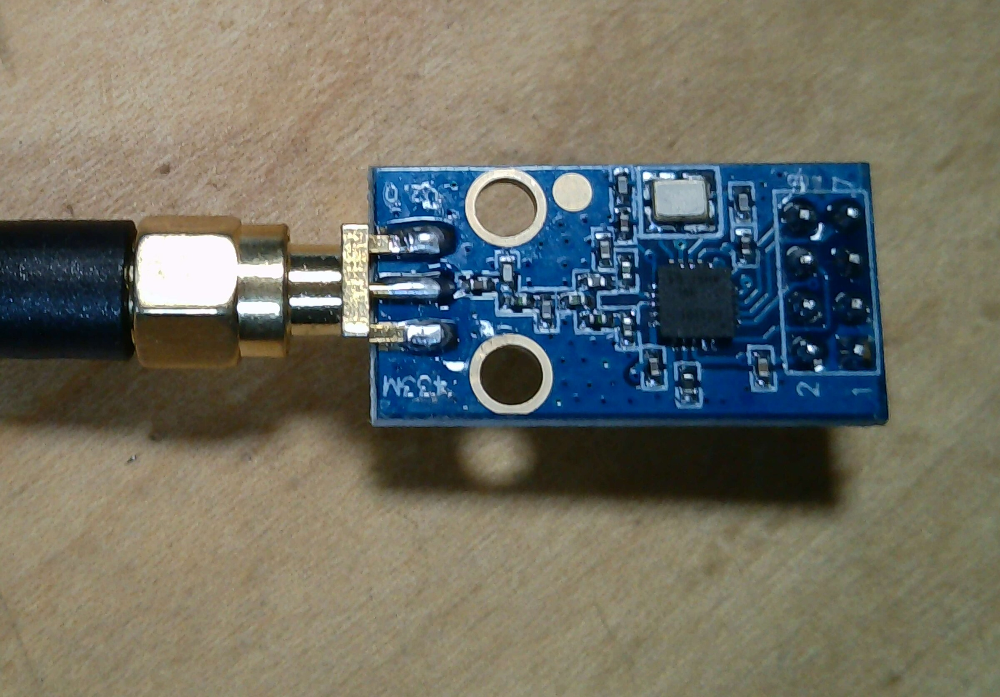

# CC1101 module details

The sub-GHz radio is the DWEII CC1101 module with SMA antenna. The photographed
board has an eight-position header but no readable silkscreened pin names.
The signal functions below are verified from the CC1101 datasheet; the
physical header order remains unconfirmed.

> **CC1101 module reference** — 433 MHz module with SMA antenna.
>
> 

Product reference: [DWEII CC1101 module listing](https://www.amazon.com/dp/B0CSYX1454)

## SPI and control signals

| Signal | Typical CC1101 breakout role | Status |
|---|---|---|
| VCC | Module supply | Datasheet function |
| GND | Ground | Datasheet function |
| SCK / SCLK | SPI clock | Datasheet function |
| MOSI / SI | SPI data to module | Datasheet function |
| MISO / SO | SPI data from module | Datasheet function |
| CSN / CS | SPI chip select | Datasheet function |
| GDO0 | Configurable interrupt/data output | Datasheet function |
| GDO2 | Configurable interrupt/data output | Datasheet function |

Reference: [TI CC1101 datasheet](https://www.ti.com/lit/ds/symlink/cc1101.pdf)

Do not use the table to infer physical header order. Confirm that order with a
continuity test or a board-specific diagram before applying power.
