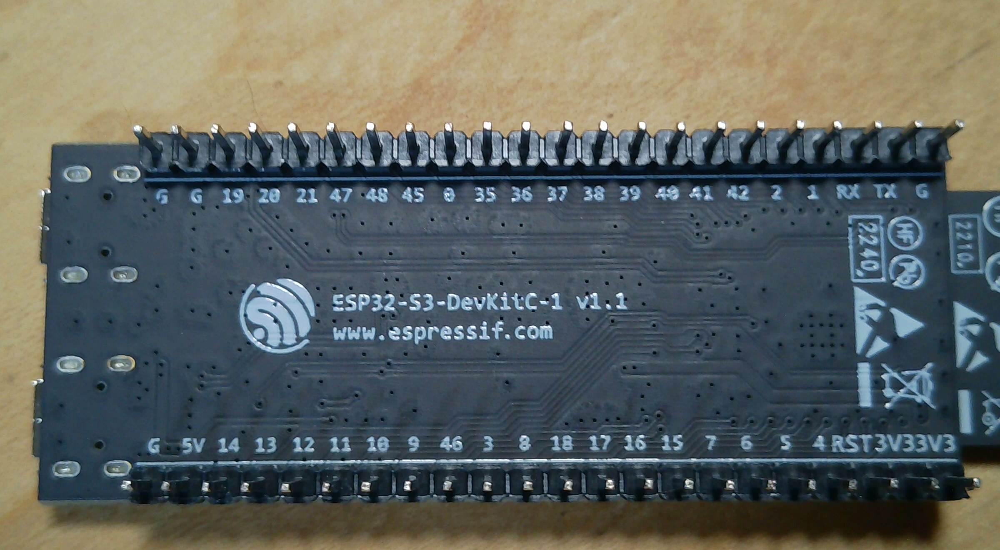
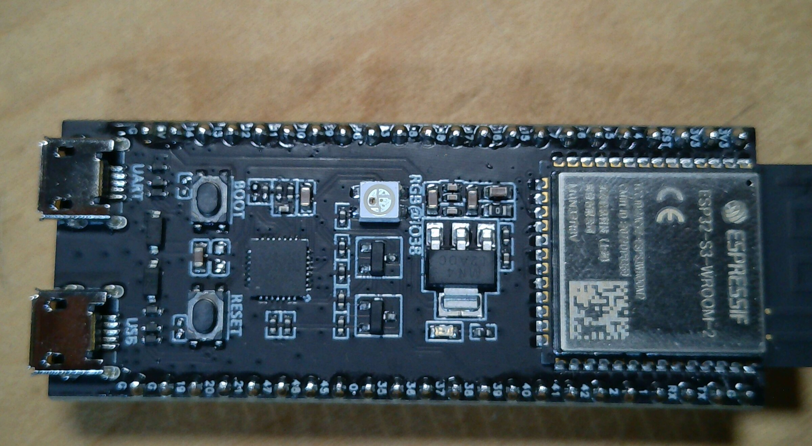

# Controller board details

The controller is an **ESP32-S3-DevKitC-1 V1.1** development board. The
rear silkscreen is the clearest source for the header labels in the photos.
The rear photo is shown with the USB connectors at the left; because this is
the reverse side of the board, do not compare its top and bottom edges to a
front-side drawing without accounting for that orientation.

> **Controller rear reference** — Rear silkscreen and header labels. The
> printed labels are evidence of the board marking, not yet the project's
> final peripheral assignments.
>
> 

> **Controller front reference** — ESP32-S3 module, USB connectors, buttons,
> and status hardware.
>
> 

## Observed rear header labels

| Header edge in the rear photo | Labels, left to right |
|---|---|
| Upper edge | GND, GND, GPIO19, GPIO20, GPIO21, GPIO47, GPIO48, GPIO45, GPIO0, GPIO35, GPIO36, GPIO37, GPIO38, GPIO39, GPIO40, GPIO41, GPIO42, GPIO2, GPIO1, RX, TX, GND |
| Lower edge | GND, 5V, GPIO14, GPIO13, GPIO12, GPIO11, GPIO10, GPIO9, GPIO46, GPIO3, GPIO8, GPIO18, GPIO17, GPIO16, GPIO15, GPIO7, GPIO6, GPIO5, GPIO4, RST, 3V3, 3V3 |

The header sequence matches the Espressif ESP32-S3-DevKitC-1 V1.1 layout when
the rear-side view is read in its physical orientation. The V1.1 RGB LED uses
GPIO38. On WROOM-2/octal-flash variants, GPIO35, GPIO36, and GPIO37 are used
internally by flash/PSRAM and are not available for peripheral wiring.

The exact flash/PSRAM suffix and final project assignments still require
confirmation.

Reference: [Espressif ESP32-S3-DevKitC-1 V1.1 user guide](https://docs.espressif.com/projects/esp-dev-kits/en/latest/esp32s3/esp32-s3-devkitc-1/user_guide_v1.1.html)
