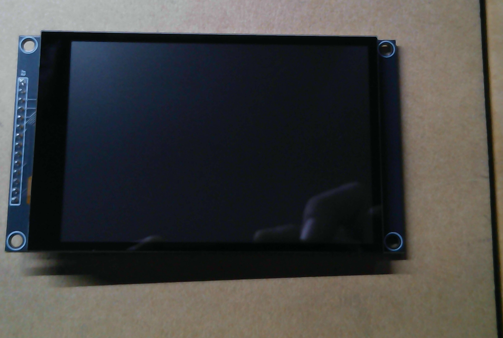
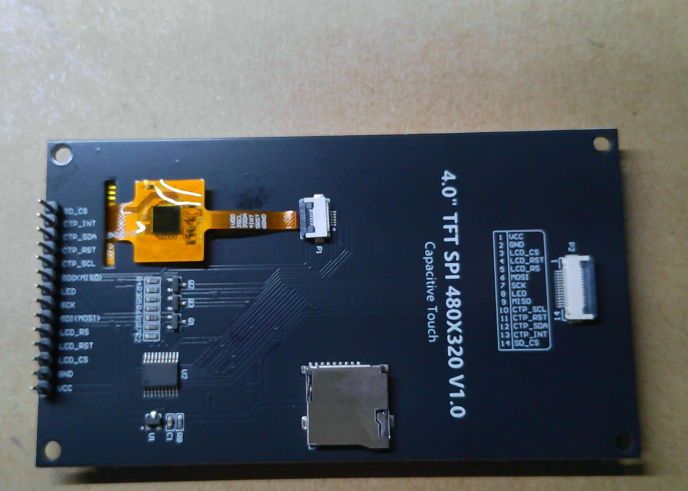
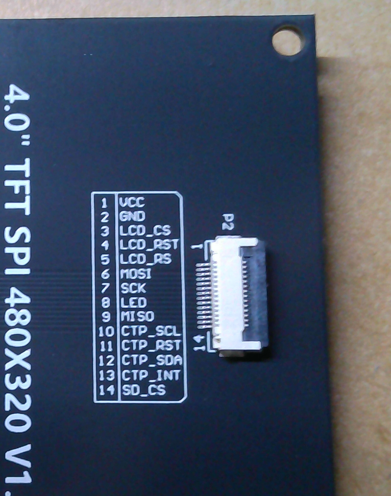
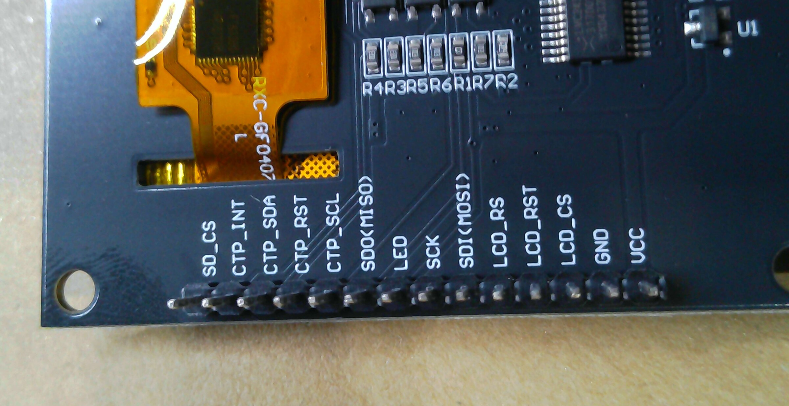

# Display details

The display currently documented for this hardware adaptation is the Hosyond
4.0-inch 480×320 capacitive SPI module. The rear silkscreen identifies it as
`4.0" TFT SPI 480X320 V1.0`. The controller is expected to be ST7796S; the
photos document the connector labels but do not by themselves confirm the
controller IC.

## Reference photos

> **Display front reference** — Unpowered front view of the assembled display module.
>
> 

> **Display back reference** — Rear board layout, storage slot, touch flex, and connectors.
>
> 

> **P2 connector callout** — Close-up of the silkscreened 14-pin connector table used below.
>
> 

> **Main header callout** — Close-up of the long header’s printed signal labels.
>
> 

The publication copies have been cropped, resized, and stripped of camera
metadata. The original camera files remain in the local photo archive and are
not included in the repository.

## P2 connector pinout

The P2 silkscreen lists these fourteen signals:

| P2 pin | Signal |
|---:|---|
| 1 | VCC |
| 2 | GND |
| 3 | LCD_CS |
| 4 | LCD_RST |
| 5 | LCD_RS |
| 6 | MOSI |
| 7 | SCK |
| 8 | LED |
| 9 | MISO |
| 10 | CTP_SCL |
| 11 | CTP_RST |
| 12 | CTP_SDA |
| 13 | CTP_INT |
| 14 | SD_CS |

## Main header labels

The long edge header is labeled with the following signals. The module does
not print numeric pin numbers beside this header, so GPIO assignments remain
unassigned until continuity testing is complete.

| Printed signal |
|---|
| SD_CS |
| CTP_INT |
| CTP_SDA |
| CTP_RST |
| CTP_SCL |
| SDO (MISO) |
| LED |
| SCK |
| SDI (MOSI) |
| LCD_RS |
| LCD_RST |
| LCD_CS |
| GND |
| VCC |

## P1 touch connector

P1 is the small flex-cable connector for the capacitive touch assembly. Its
individual contact names are not printed clearly enough in the available
photos to use as a wiring reference. Treat the P2 table and the long-header
labels as the authoritative visible markings until the touch-controller
datasheet or continuity measurements provide more evidence.
