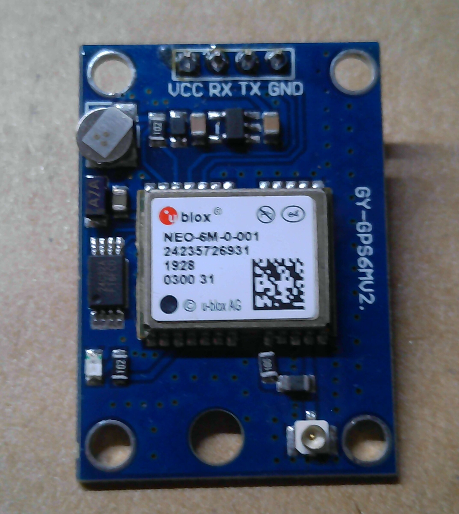
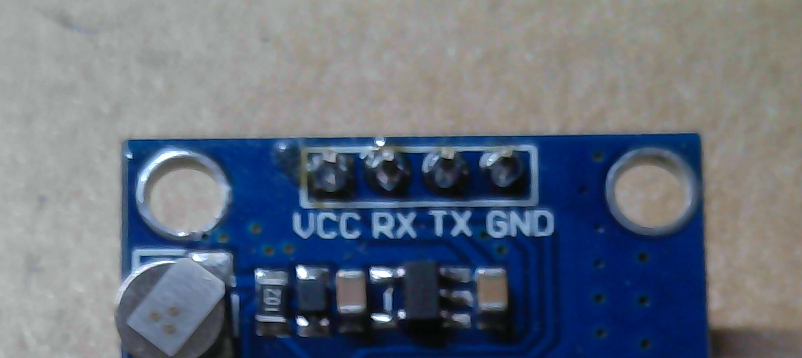

# GPS module details

The photographed module is a GY-NEO6MV2 / NEO-6M GPS board. The visible
header is confirmed as `VCC`, `RX`, `TX`, and `GND` in that order. The photos do
not confirm the module's logic-voltage tolerance or whether PPS is brought out.

> **GPS module reference** — Front view showing the u-blox NEO-6M module and
> ceramic antenna area.
>
> 

> **GPS header callout** — Close-up of the four-pin header labels.
>
> 

## Header pinout

| Header position | Printed label | Expected role |
|---:|---|---|
| 1 | VCC | Module supply; voltage still to be confirmed |
| 2 | RX | GPS serial receive |
| 3 | TX | GPS serial transmit |
| 4 | GND | Ground |

The image includes the module's visible factory identifier and machine-readable
marking. These identify the hardware, not a person or a location; no camera
location metadata is included.
