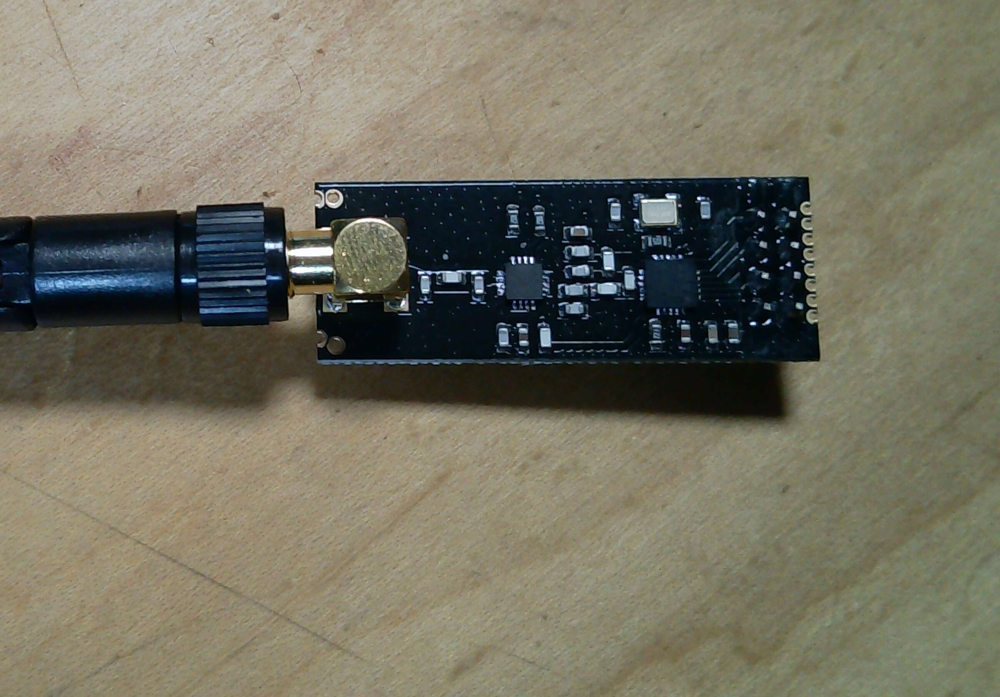

# nRF24L01+PA+LNA module details

All three 2.4 GHz radio modules are the same ACEIRMC NRF24L01+PA+LNA module
identified by the product listing. The photographed module does not have a
readable pin legend. The table below lists the verified nRF24L01+ interface;
the physical header order on this breakout remains unconfirmed.

> **nRF24 module reference** — Antenna-equipped module used for all three
> radio positions.
>
> 

Product reference: [ACEIRMC NRF24L01+PA+LNA listing](https://www.amazon.com/dp/B092ZNYLYZ)

## Standard header reference

| Signal | Role |
|---|---|
| VCC | 3.3 V module supply |
| GND | Ground |
| CE | Chip-enable control |
| CSN | SPI chip select |
| SCK | SPI clock |
| MOSI | SPI data to module |
| MISO | SPI data from module |
| IRQ | Optional interrupt output |

The listing describes a 3.0–3.6 V operating range while also making a
separate 5 V-tolerance claim. Treat the module as a 3.3 V device until the
exact board documentation and the power rail have been verified.

Reference: [nRF24L01+ product specification](https://devzone.nordicsemi.com/cfs-file/__key/communityserver-discussions-components-files/4/content.pdf)
