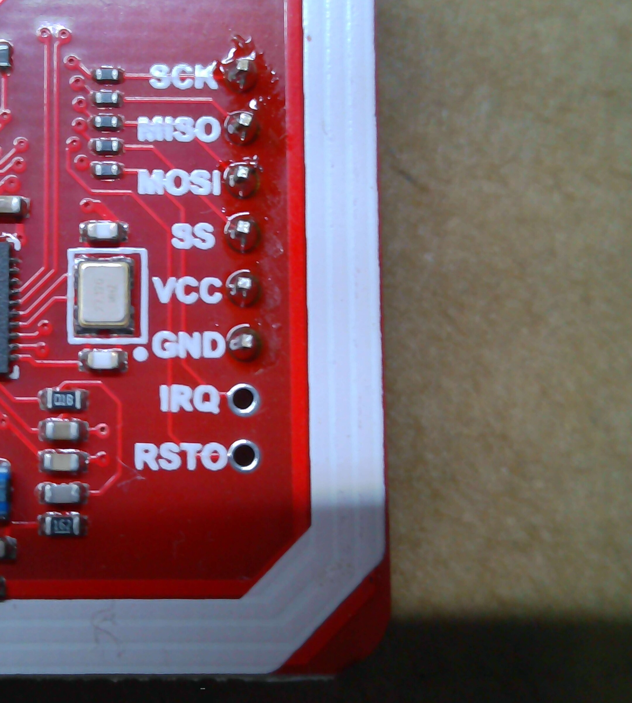

# PN532 module details

The photographed board is a PN532 NFC/RFID module. The right-side silkscreen
shows the SPI-oriented signal group below. The board also exposes other
interface pads and configuration jumpers. The printed labels are confirmed;
the jumper position selecting SPI and the electrical levels remain unconfirmed.

> **PN532 module reference** — Front view showing the module, antenna area,
> interface selector, and exposed headers.
>
> 

> **PN532 SPI header callout** — Close-up of the printed signal labels.
>
> 

## Visible SPI-side labels

| Printed label | Intended connection |
|---|---|
| SCK | SPI clock |
| MISO | SPI data from the module |
| MOSI | SPI data to the module |
| SS | SPI chip select |
| VCC | Module supply; voltage still to be confirmed |
| GND | Ground |
| IRQ | Optional interrupt |
| RSTO | Reset/output label as printed |

## Other visible pads

The opposite interface area is marked `SCL`, `SDA`, `VCC`, and `GND`, and the
board has an interface-selection jumper block. Confirm the selected interface
and jumper state before wiring or firmware changes.
